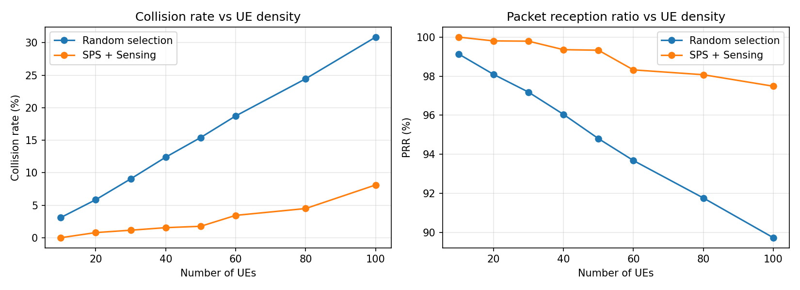

# NR-V2X Mode 2 Resource Scheduler Simulator

A system-level simulator for 3GPP NR sidelink Mode 2 autonomous resource
selection, written in C++17 with Python analysis scripts.

In Mode 2 there is no gNB scheduling sidelink resources — each UE senses the
channel and picks its own time-frequency resource. This simulator implements
that selection procedure and measures how well it avoids collisions as vehicle
density grows.

## Status

| Version | Feature | Done |
|---|---|---|
| v0.1 | Resource pool, random selection, collision detection | ☑ |
| v0.2 | CSV output, multi-seed sweep, plotting | ☑ |
| v0.3 | Semi-persistent scheduling with resource reservation | ☑ |
| v0.4 | Sensing window + TS 38.214 §8.1.4 resource selection | ☑ |
| v0.5 | Shadow fading, PRR vs distance | ☐ |
| v0.6 | Re-evaluation before transmission (NR-specific) | ☐ |
| v1.0 | Parameter sensitivity analysis | ☐ |

SPS comes before sensing deliberately. Sensing works by decoding the reservation
period announced in another UE's SCI and avoiding the slots it implies. Without
SPS every transmission picks a fresh random resource, so the sensing history
carries no information about future occupancy and the algorithm has nothing to
exclude. Predictable traffic is a precondition for sensing to help at all.

## Build

Requires a C++17 compiler. No external dependencies.

```bash
make            # release build
make run
make debug      # -O0 -g with address and UB sanitizers
make clean
```

## Run

```bash
./v2xsim --ues 50 --duration 10000
./v2xsim --ues 50 --sensing            # sensing-based selection
./v2xsim --ues 50 --sensing --sps      # with SPS
```

Sweep UE density and plot:

```bash
bash scripts/sweep.sh
```

## Architecture

```
Config          all simulation parameters in one struct
Resource        a (slot, subchannel_start, num_subchannels) block
ResourcePool    the time-frequency grid; enumerates candidate resources
UE              position, mobility, traffic generation, resource selection
SensingWindow   per-UE history of observed transmissions and RSRP
Channel         log-distance pathloss, dBm/mW conversion
Simulator       main slot loop, collision detection, metrics
```

The simulator runs one slot at a time. Each UE that has a packet selects a
resource in a future slot within the selection window `[n+T1, n+T2]`, so
transmissions are recorded into that future slot's bucket. When the simulation
reaches that slot, overlapping transmissions are evaluated for collision.

### Resource selection

Selection runs in three stages, wrapped in a threshold retry loop:

1. **Enumerate** every candidate resource in `[n+T1, n+T2]`.
2. **Build an occupancy map** from the sensing history — one pass over the
   records, marking the future slots each observed reservation implies.
3. **Filter and pick** uniformly at random from what survives.

The occupancy map exists for performance. Testing each candidate against the
full sensing history would be `O(candidates × records)` — roughly 400 candidates
against a window holding thousands of records, on every selection. Inverting the
loop makes map construction `O(records)` and each candidate test `O(1)`.

The final pick is random by design. In a distributed system with no coordinator,
a deterministic rule causes UEs with similar observations to converge on the same
resource. Sensing narrows the set; randomisation spreads the choice within it.

### Half-duplex exclusion

A UE transmitting in slot *z* cannot receive in it. TS 38.214 requires treating
such unmonitored slots as potentially reserved: for every candidate slot *m*
where `(m − z) mod P == 0`, the entire slot is excluded, since the UE has no way
to know which subchannels were used.

With a 1100-slot sensing window and a 100 ms period, roughly 11 slots are
unmonitored, excluding about 11% of the selection window. Skipping this step
would produce better numbers while modelling a receiver that can hear while
transmitting.

## Key parameters

Defaults follow 3GPP TS 38.214 where applicable.

| Parameter | Default | Meaning |
|---|---|---|
| `sensing_window_ms` | 1100 | How far back a UE remembers observations (T0) |
| `selection_start_ms` | 1 | Earliest slot a UE may select (T1) |
| `selection_end_ms` | 100 | Latest slot, bounded by packet delay budget (T2) |
| `rsrp_threshold_dbm` | -110 | Resources above this are excluded |
| `candidate_ratio` | 0.2 | Keep the best 20% of remaining resources |
| `prob_resource_keep` | 0.4 | Probability of keeping a resource after the counter expires |

## Validating results

Simulation output is only meaningful if you can explain it. Two checks are used
here: a link budget that predicts what the numbers *should* be, and a set of
invariants that must hold regardless of parameters.

### Link budget

With the default configuration, noise is never the limiting factor. At the edge
of the communication range:

```
PL(300 m) = 47.86 + 20·log₁₀(300)  = 97.40 dB
Rx power  = 23 − 97.40             = −74.40 dBm
SNR       = −74.40 − (−95)         = 20.60 dB
Threshold =                           3.00 dB
```

The margin at the worst-case distance is 17.6 dB, so a packet can only fail
when an interferer is present. With a pathloss exponent of 2.0 the SINR between
two transmitters reduces to a distance ratio:

```
SINR ≈ 20·log₁₀(d_interferer / d_signal)
```

Falling below the 3 dB threshold therefore requires the interferer to be within
1.41× the distance of the wanted transmitter, which happens in roughly half of
the collision events. That predicts:

```
PRR ≈ 1 − (collision_rate × 0.5)
```

At 50 UEs the measured collision rate is 14.4%, so the predicted PRR is ~92.8%
against a measured 93.3%. The model is internally consistent.

### Results



Each point is the mean of five seeds. Two configurations are compared: random
selection, and the full sensing-based procedure with SPS.

| UEs | Random | Sensing | Reduction |
|---|---|---|---|
| 20 | 5.8% | 0.7% | −88% |
| 50 | 15.4% | 1.7% | −89% |
| 100 | 30.7% | 8.1% | −74% |

The interesting result is not the offset but the change in slope. Random
selection scales linearly with density — collision rate is proportional to the
number of transmissions competing for the same pool. Sensing is sub-linear, and
nearly flat below 40 UEs.

At 100 UEs the reduction narrows to 74%. The resource pool is approaching
saturation, so sensing increasingly cannot find a clean resource to move to.
That inflection marks the practical capacity limit of this configuration.

Residual collisions under sensing never reach zero, and should not. Three
mechanisms remain:

- **Half-duplex blindness.** Two UEs transmitting in the same slot never hear
  each other, so neither can learn to avoid the other.
- **Simultaneous reselection.** Two UEs selecting in the same slot both observe
  the same resource as free and both take it.
- **Sensing window warm-up.** A UE that has just reselected has incomplete
  history for the resource it is now using.

PRR follows the same pattern. Under random selection it degrades from 99% to
90% across the density range; with sensing it stays above 97% throughout. For
safety messaging that is the difference between usable and unreliable.

### Invariants

These must hold for any parameter set. If one breaks, there is a bug.

| Check | Expected |
|---|---|
| `total_transmissions` | ≈ `num_ues × sim_duration_ms / packet_period_ms` |
| Same seed, two runs | Byte-identical output |
| UE count ↑ | Collision rate ↑, PRR ↓, monotonically |
| Very low UE count (≤5) | Collision rate ≈ 0, PRR ≈ 100% |
| Sensing enabled | Collision rate strictly lower than random, `total_transmissions` unchanged |
| `collisions` | ≤ `total_transmissions` |
| `rx_success` | ≤ `rx_opportunities` |

Note that PRR is higher than `1 − collision_rate` would suggest. This is
expected: a resource collision does not always destroy reception, because a
nearby transmitter can be decoded despite a distant interferer sharing the same
resource. This is the capture effect, and its presence is a sign the SINR model
is doing something more meaningful than a binary overlap test.

## Relationship to LTE-V2X Mode 4

The sensing procedure implemented here — sensing window, RSRP-based exclusion,
SPS with a reselection counter, keeping the best 20% and picking at random — is
substantially the same in LTE-V2X Mode 4 (TS 36.213 §14.1.1.6) and NR-V2X Mode 2
(TS 38.214 §8.1.4). NR inherited the mechanism rather than replacing it.

Parameter values here follow the NR configuration (1100 ms sensing window,
100 ms selection window). The NR-specific features that do *not* appear in LTE
are listed below, with their implementation status.

| Feature | LTE Mode 4 | NR Mode 2 | Implemented |
|---|---|---|---|
| Numerology | Fixed 15 kHz, 1 ms subframe | 15–120 kHz, sub-ms slots | ☐ |
| HARQ feedback | Blind retransmission only | PSFCH feedback channel | ☐ |
| Cast type | Broadcast only | Unicast, groupcast, broadcast | ☐ |
| Aperiodic traffic | Periodic assumed | Both supported | ☐ |
| Re-evaluation | — | Re-check before transmitting | ☐ v0.6 |
| Pre-emption | — | Higher priority can displace | ☐ |
| RSRP threshold | Fixed | Varies by priority pair (p_i, p_j) | ☐ |

### Planned: re-evaluation (v0.6)

Re-evaluation is the most tractable of these and produces a measurable result,
so it is the next feature planned.

In LTE Mode 4 a UE that selects a resource commits to it. If another UE reserves
the same resource in the interval between selection and transmission, neither
side finds out until they collide. NR closes this window: before transmitting,
the UE re-checks its sensing history against the selected resource, and reselects
if the resource has since been reserved by a transmission whose RSRP exceeds the
threshold.

Implementation sketch:

- Record `selection_slot` alongside the granted resource.
- At slot `tx_slot − T3`, rebuild the occupancy map over the intervening sensing
  records and test whether the grant is still free.
- If not, run selection again over the remaining window.
- Count re-evaluation triggers as a metric in their own right.

The experiment this enables: how many collisions does re-evaluation recover, and
at what density does it start to matter? The selection window here is 100 slots,
so the exposure interval is long enough that the effect should be visible —
which is also why the feature exists in the standard.

## Simplifications

This is a system-level simulator focused on the MAC-layer selection procedure.
Deliberately out of scope:

- No fast fading — pathloss is distance-only
- No shadow fading — see calibration notes below
- No PHY processing — reception is an SINR threshold test
- Straight-road mobility at constant speed
- Broadcast traffic only; no unicast, groupcast, or HARQ feedback
- Any resource overlap is treated as full-band interference; partial overlap is
  not weighted by the fraction of shared subchannels

## Calibration notes

The v0.1 defaults are deliberately optimistic so that the MAC-layer behaviour is
visible without being masked by channel effects. Published NR-V2X studies report
PRR in the 70–90% range at comparable densities; this simulator sits above that
because of the following, listed in order of impact.

| Change | Current | More realistic | Effect |
|---|---|---|---|
| Shadow fading | none | log-normal, σ = 3–8 dB | Largest gap. Deep fades cause failures that a deterministic pathloss model never produces. |
| `pathloss_exponent` | 2.0 (free space) | 2.7–3.0 highway LOS | Faster decay with distance; edge-of-range reception degrades. |
| `comm_range_m` | 300 | 500–1000 | Extends the accounting to distances where the link genuinely fails. |
| `sinr_threshold_db` | 3.0 | 5–10 for higher MCS | 3 dB corresponds to a low-rate QPSK operating point. |

These are intentionally deferred. Shadow fading is planned for v0.5, where an
A/B comparison with and without it becomes an analysis result in its own right
rather than just a parameter change.

## References

- 3GPP TS 38.214 §8.1.4 — UE procedure for determining the subset of resources
- 3GPP TS 38.321 — MAC protocol specification for sidelink
